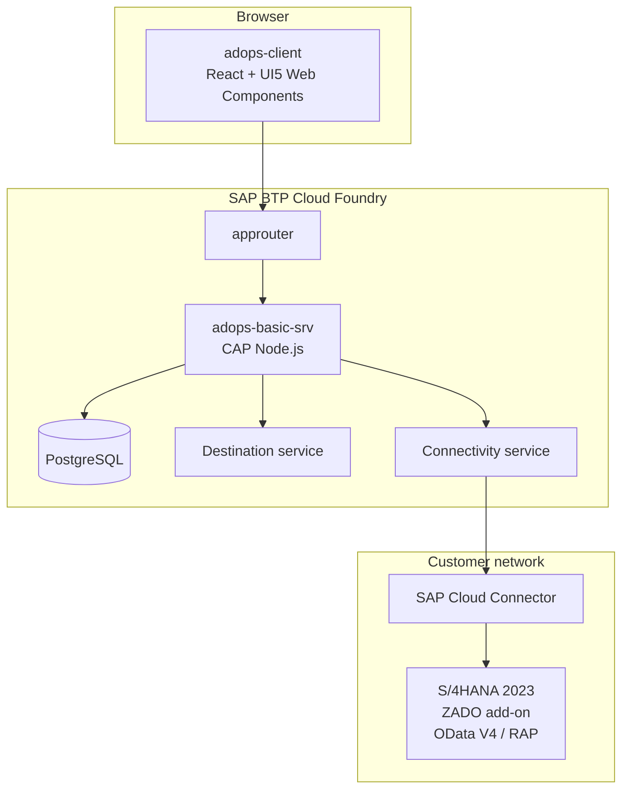

# AdoptOps Documentation

Numbered chapters, one directory per area. Each chapter owns its topic; the
approved implementation plan is the source these chapters elaborate.

| Chapter | Content |
|---|---|
| [00-overview](00-overview/) | What AdoptOps is, the Connect → Analyse → Propose → Review → Activate journey |
| [01-bill-of-materials](01-bill-of-materials/) | BTP entitlements per tier (PRA chapter 01/20 analogue) |
| [02-product-journey](02-product-journey/) | End-to-end user journey and personas |
| [03-architecture](03-architecture/) | Provider/consumer subaccounts, runtime topology, module map |
| [04-data-model](04-data-model/) | `adops.db` entities, tenant scoping, retention |
| [05-deployment-tiers](05-deployment-tiers/) | basic (PostgreSQL) vs enterprise (HANA/MTX), deploy runbooks |
| [06-s4-integration](06-s4-integration/) | Destinations, Cloud Connector, Location IDs, s4-http-client |
| [07-usage-extraction](07-usage-extraction/) | ST03N/STAD/AGR/USR02 sources, snapshots, task runner |
| [08-catalog-and-proposals](08-catalog-and-proposals/) | Catalog derivation, overlay, scoring engine |
| [09-activation-and-transport](09-activation-and-transport/) | Plans, steps, simulation, CTS, activation manifest, local replay |
| [10-security-authorization](10-security-authorization/) | Four-role model, ABAP technical users, .sush/SU21 content |
| [11-privacy-pseudonymisation](11-privacy-pseudonymisation/) | Pseudonymisation, identified opt-in, GDPR/works-council notes |
| [12-multitenancy-pra-alignment](12-multitenancy-pra-alignment/) | Partner Reference Application alignment, MTX end-state |
| [13-operations-observability](13-operations-observability/) | Cloud Logging, Audit Log service, task monitoring |
| [14-local-development](14-local-development/) | sqlite/hybrid modes, port 4104, mocked users |
| [15-target-system-configuration](15-target-system-configuration/) | Onboarding a target system, consumer-subaccount destinations |
| [16-troubleshooting](16-troubleshooting/) | Known failure modes and remedies |

## Runtime at a glance

